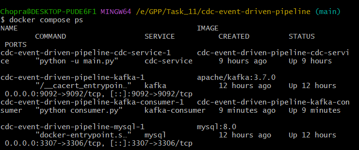
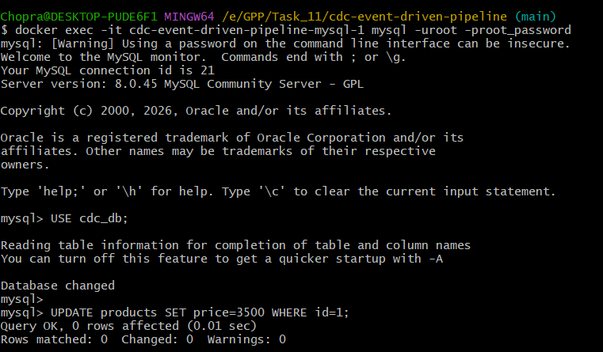
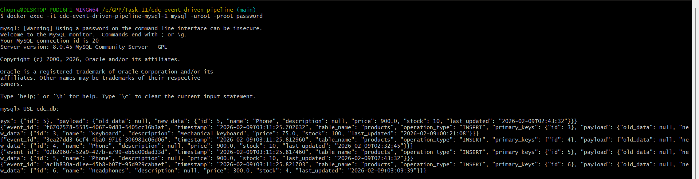
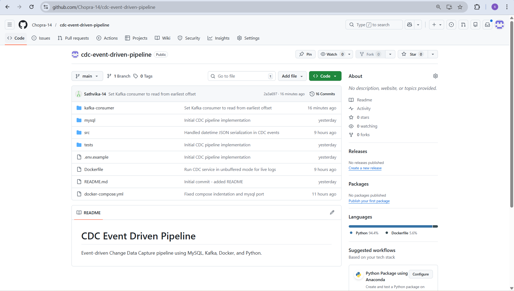

# CDC Event Driven Pipeline

Event-driven Change Data Capture (CDC) pipeline using MySQL, Apache Kafka, Docker, and Python.

This project demonstrates how database changes (INSERT, UPDATE, DELETE) can be captured in real time and published as structured events to Kafka.

---

## Architecture Overview

MySQL → CDC Service (Python) → Kafka → Consumer

The CDC service continuously polls the MySQL database, detects changes, converts them into JSON events, and publishes them to a Kafka topic.

---

## Tech Stack

- MySQL 8.0  
- Apache Kafka  
- Docker & Docker Compose  
- Python  
- kafka-python  
- mysql-connector-python  

---

## Project Structure

```text
cdc-event-driven-pipeline/
├── src/                # CDC service logic
├── kafka-consumer/    # Kafka consumer
├── mysql/             # MySQL initialization
├── tests/             # Unit tests
├── docker-compose.yml
├── Dockerfile
└── README.md
```
### Setup Instructions
Prerequisites
Docker Desktop

Git

### Clone Repository
git clone https://github.com/Chopra-14/cdc-event-driven-pipeline.git
cd cdc-event-driven-pipeline
Start Pipeline
docker compose up --build
### Services started:

MySQL

Kafka

CDC Service

Kafka Consumer

### Verify:

docker compose ps
Simulating Database Changes
# Enter MySQL container:

docker exec -it cdc-event-driven-pipeline-mysql-1 mysql -uroot -proot_password
# Run:

USE cdc_db;

UPDATE products SET price=3500 WHERE id=1;
INSERT INTO products(name,price,stock) VALUES("Phone",900,10);
DELETE FROM products WHERE id=2;
Kafka Event Schema
{
  "event_id": "uuid",
  "timestamp": "ISO timestamp",
  "table_name": "products",
  "operation_type": "INSERT | UPDATE | DELETE",
  "primary_keys": {"id": 1},
  "payload": {
    "old_data": {},
    "new_data": {}
  }
}
Error Handling & Retries
Kafka producer retries on failure

Decimal and datetime values are normalized before publishing

Graceful shutdown implemented using signal handlers

Python runs in unbuffered mode for live logging

---

## Demo Screenshots

### Docker Compose Services Running


### MySQL Update Command


### Kafka CDC Events


### GitHub Repository



### Conclusion
This project demonstrates a complete CDC pipeline with real-time change propagation using Kafka. It highlights core data engineering concepts such as event-driven architecture, containerization, and data consistency.